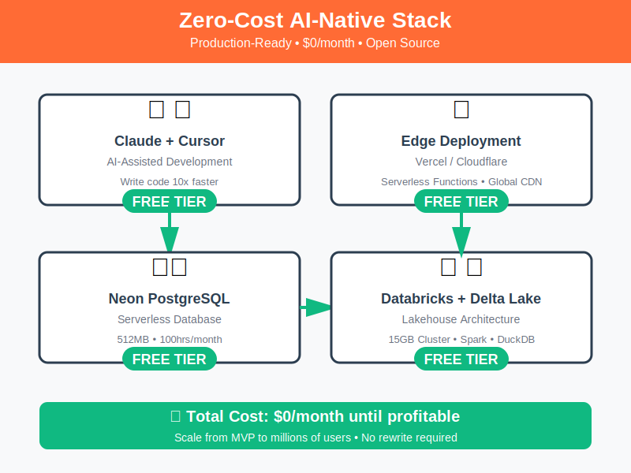
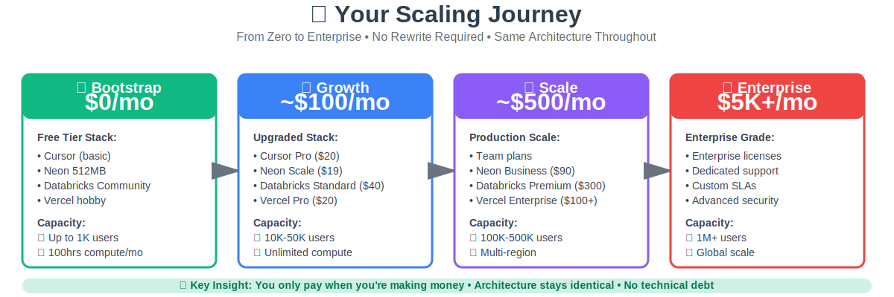

# Visual Assets for Your Blog Post

## 📊 What You Have

You now have **4 professional diagrams** ready to insert into your blog post:

### 1. **Main Architecture Diagram** ⭐
**File**: `zero-cost-architecture-diagram.svg`
- **Purpose**: Detailed technical reference architecture
- **Size**: 1400x900px (scalable SVG)
- **Style**: Professional, Databricks-inspired
- **Best for**: Technical deep-dive, GitHub README

### 2. **Simple Architecture Diagram** 
**File**: `zero-cost-simple-diagram.svg`
- **Purpose**: Quick overview of the 4 main components
- **Size**: 800x600px (scalable SVG)
- **Style**: Clean, minimal, social-media friendly
- **Best for**: Blog header, Twitter posts, presentations

### 3. **Cost Comparison Diagram** 💰
**File**: `cost-comparison-diagram.svg`
- **Purpose**: Side-by-side cost comparison
- **Size**: 1000x700px (scalable SVG)
- **Impact**: Shows $15,600+ first year savings
- **Best for**: Blog body, LinkedIn posts, pitch decks

### 4. **Scaling Journey Diagram** 🚀
**File**: `scaling-journey-diagram.svg`
- **Purpose**: Growth path from $0 to enterprise
- **Size**: 1200x400px (scalable SVG)
- **Message**: Pay only when profitable
- **Best for**: Blog conclusion, investor decks, roadmap discussions

---

## 📝 How to Use in Your Blog Post

Here's the recommended flow for your <500 word blog post:

### Blog Structure with Visuals

```markdown
---
title: "The AI-Native Stack: A Blueprint to Zero-Cost Innovation"
---

# The AI-Native Stack: A Blueprint to Zero-Cost Innovation

**We're witnessing the greatest democratization of innovation in human history.**
[Your opening paragraph...]

## The Old World Is Dead

[Your "Old World" section...]

## The New Stack: Power at Zero Cost


*Figure 1: The complete free stack - from development to production*

Here's the blueprint that changes everything:

**Development**: Claude + Cursor...
**Data**: Serverless PostgreSQL...
**Analytics**: Databricks Community Edition...
**Architecture**: Open-source everything...

This isn't a toy stack. It's production-grade...

## Why This Matters Now

[Your "Why This Matters" section...]

## The Real Cost of "Free"


*Figure 2: $15,600+ saved in your first year*

The AI revolution isn't about who has the biggest models...

Bootstrapping used to mean sacrifice. Not anymore...

## The Lakehouse Advantage


*Figure 3: Production-ready Lakehouse architecture on free tiers*

Here's the secret weapon: Lakehouse architecture...

## Your Path to Scale


*Figure 4: From $0 to enterprise - pay only when profitable*

You can wait for funding. Wait for the "right" conditions...

Or you can start building today...

**The only cost is courage.**

---

*The future isn't funded. It's forked.*
```

---

## 🎨 Visual Strategy

### For Maximum Impact:

**Opening** (Simple Diagram)
- Hook readers with clean, understandable visual
- Show all 4 components at a glance
- Emphasize "FREE TIER" badges

**Middle** (Cost Comparison)
- Quantify the value proposition
- Make the savings tangible
- Red vs Green creates visual contrast

**Technical Deep-Dive** (Main Architecture)
- For readers who want details
- Shows professional, enterprise-grade design
- Proves this isn't a toy stack

**Closing** (Scaling Journey)
- Leave them with the growth vision
- Show the upgrade path
- Remove fear of "what happens when I scale?"

---

## 📱 Platform-Specific Recommendations

### For Different Platforms:

#### **Blog Post (Medium/Substack/Personal)**
```markdown
Use all 4 diagrams in this order:
1. Simple diagram (intro)
2. Cost comparison (value prop)
3. Main architecture (technical credibility)
4. Scaling journey (closing vision)
```

#### **Twitter/X Thread**
```markdown
Use: Simple diagram + Cost comparison
Why: Quick visual impact, easy to digest
Format: Convert to PNG at 2x resolution
```

#### **LinkedIn Post**
```markdown
Use: Cost comparison ONLY
Why: Business decision-makers care about ROI
Format: PNG, professional border
```

#### **GitHub README**
```markdown
Use: Main architecture + Scaling journey
Why: Technical audience wants details
Format: Keep as SVG (better for GitHub)
```

#### **Presentation/Pitch Deck**
```markdown
Use: All 4 across multiple slides
Slide 1: Problem (Traditional costs)
Slide 2: Solution (Simple diagram)
Slide 3: Architecture (Main diagram)
Slide 4: Business Model (Scaling journey)
```

---

## 🎯 Social Media Templates

### Twitter Thread with Visuals

```
🧵 I just built a production-grade AI app that costs $0/month.

Here's the stack: [Simple Diagram]

Traditional approach? $1,300/month + $2,000 setup.

My approach? $0 until profitable.

Here's the breakdown: [Cost Comparison]

[Continue thread with blog link]
```

### LinkedIn Post with Visual

```
💰 We just saved our startup $15,600 in the first year.

Without compromising on quality.
Without technical debt.
Without vendor lock-in.

How? [Cost Comparison Image]

The secret: Leveraging free tiers of production-grade tools:
• Claude + Cursor for AI-assisted development
• Neon for serverless PostgreSQL
• Databricks Community for Lakehouse analytics
• Vercel for edge deployment

This isn't a toy stack. It's the same architecture that scales to millions of users.

The only difference? You start at $0.

Full breakdown: [Link to blog]

#Startups #AI #OpenSource #Bootstrapping
```

---

## 💡 Pro Tips

### Making Diagrams Stand Out

1. **Add white space around images**
   ```css
   img {
     margin: 2rem 0;
     box-shadow: 0 4px 6px rgba(0,0,0,0.1);
   }
   ```

2. **Use captions effectively**
   - Keep them short (under 10 words)
   - Focus on the "so what?"
   - Example: "*$15,600+ saved in year one*"

3. **Create visual hierarchy**
   - Largest: Main hero image (simple diagram)
   - Medium: Supporting evidence (cost comparison)
   - Detailed: Technical proof (main architecture)
   - Forward-looking: Vision (scaling journey)

4. **Mobile optimization**
   - All diagrams are readable on mobile
   - Text is large enough (minimum 13px)
   - Clear contrast ratios

5. **Accessibility**
   - Always include alt text
   - Describe the key insight, not just content
   - Example: `alt="Zero-cost stack saves $15K+ vs traditional approach"`

---

## 🔄 Customization Guide

### Want to Modify the Diagrams?

All diagrams are **editable SVGs**. Here's how:

1. **Open in text editor**
   ```bash
   code zero-cost-architecture-diagram.svg
   ```

2. **Change colors**
   - Search for hex codes (e.g., `#FF6B35`)
   - Replace with your brand colors

3. **Update text**
   - Find `<text>` elements
   - Change content between tags

4. **Adjust layout**
   - Modify `x` and `y` attributes
   - Experiment with positioning

5. **Add your logo**
   ```xml
   <image x="10" y="10" width="100" height="50" 
          href="your-logo.png"/>
   ```

### Quick Color Schemes

**Default (Current)**
- Primary: `#FF6B35` (Orange)
- Success: `#10B981` (Green)
- Info: `#3B82F6` (Blue)

**Professional Blue**
- Primary: `#2563EB`
- Success: `#059669`
- Dark: `#1E293B`

**Tech Purple**
- Primary: `#7C3AED`
- Success: `#10B981`
- Dark: `#1F2937`

---

## 📊 Analytics & Tracking

### Measure Impact

Track which diagrams resonate:

```html
<!-- Add tracking to image links -->
<a href="/architecture" 
   onclick="gtag('event', 'click', {
     'event_category': 'diagram',
     'event_label': 'architecture_click'
   })">
  
</a>
```

### A/B Test Variations

Test different diagram combinations:
- **Version A**: All 4 diagrams
- **Version B**: Only cost comparison
- **Version C**: Simple + scaling journey

Measure: Time on page, scroll depth, conversions

---

## ✅ Final Checklist

Before publishing:

- [ ] All SVG files saved and accessible
- [ ] Alt text added to all images
- [ ] Mobile preview looks good
- [ ] Images load fast (SVGs are tiny!)
- [ ] Links to diagrams work
- [ ] Social media previews set
- [ ] GitHub repository includes diagrams
- [ ] License information clear

---

## 🚀 Distribution Strategy

### Week 1: Blog Launch
- Publish blog with all 4 diagrams
- Share simple diagram on Twitter
- Post cost comparison on LinkedIn
- Submit to Hacker News

### Week 2: Deep Dive
- Twitter thread using main architecture
- LinkedIn article on scaling journey
- Dev.to post with technical details

### Week 3: Community
- Share in relevant Discord servers
- Post in Reddit (r/webdev, r/datascience)
- Engage with comments

### Ongoing
- Update diagrams based on feedback
- Create variations for different audiences
- Track which visuals perform best

---

## 💬 Caption Templates

Use these with your diagrams:

**Simple Diagram:**
- "The entire stack. Zero dollars."
- "Production-ready architecture for $0/month"
- "Free tiers that actually scale"

**Cost Comparison:**
- "$15,600+ saved. Same quality."
- "Traditional vs. modern: pick your price"
- "Why pay when you can innovate for free?"

**Main Architecture:**
- "Lakehouse architecture, community edition"
- "From idea to production in hours, not weeks"
- "Enterprise patterns, startup budget"

**Scaling Journey:**
- "Pay only when profitable"
- "$0 to enterprise: the new normal"
- "Your growth path, no rewrites required"

---

**Remember**: These aren't just diagrams. They're your value proposition, visualized.

Use them everywhere. Customize them. Make them yours.

The future isn't funded. It's forked. 🚀
